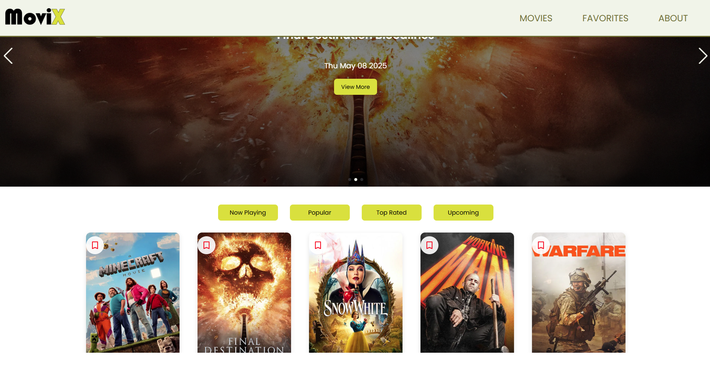

🎬 Movix
Movix is a responsive React-based movie application that fetches real-time data from the TMDB API. It allows users to explore top-rated, upcoming, trending, and currently playing movies. Users can also view detailed movie information and add favorites.

🚀 Tech Stack
React with Vite

TMDB API for movie data

React Context API for state management

SASS

React Router for navigation.

📸 Screenshots

🧩 Features
🔄 Live Movie Data: Real-time fetch from TMDB API (titles, posters, ratings, overviews)

❤️ Favorites System: Mark/unmark favorites with an interactive graphics.

🖼️ Movie Cards: Stylish cards with movie poster, title, rating, and description
📺 Details Page: Dedicated movie page with cast carousel and storyline

🎞️ Hero Slider: A featured movies slider on the homepage

🔘 Category Tabs: Tabs for "Top Rated", "Trending", "Upcoming", and "Now Playing"
📱 Responsive Design: Mobile-first layout using CSS media queries

🗂️ Folder Structure
<pre lang="markdown"> 
movix/
│
├── public/
│   └── index.html
├── src/
│   ├── assets/
│   ├── components/
│   ├── context/
│   ├── router/
│   ├── pages/
│   ├── styles/
│   ├── utils/
│   ├── App.jsx
│   ├── main.jsx
│   └── index.css
├── .gitignore
├── package.json
├── README.md
└── vite.config.js
</pre>
  
🛠️ Installation
<pre>
git clone https://github.com/shanikauwu1/movix.git
cd movix
npm install
npm run dev
</pre>
You’ll need a TMDB API key. Create a .env file and add:

<pre>VITE_TMDB_API_KEY=your_api_key</pre>

🔗 Live Demo
[View Live](https://shanikacode.in/movix/)

📬 Contact
Shanika Ekanayake
[LinkedIn](https://www.linkedin.com/in/shanikajayawardane/) | GitHub

